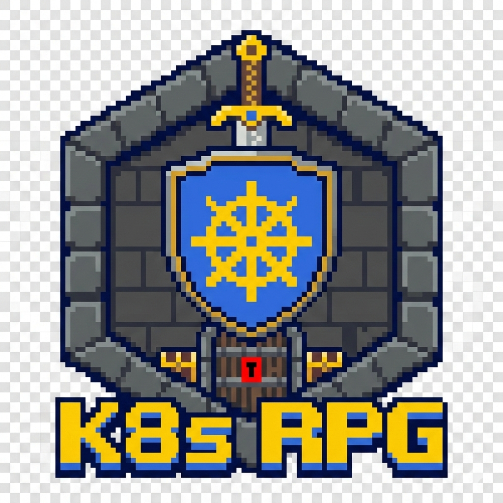

<div align="center">
  
  
  # Kubernetes RPG
  
  *An 8-bit dungeon crawler powered by kro*
</div>

---

An interactive, turn-based dungeon game where the entire game state is orchestrated by [kro](https://kro.run) ResourceGraphDefinitions running as an [EKS Managed Capability](https://docs.aws.amazon.com/eks/latest/userguide/kro.html). No custom controllers, no external databases. Just declarative resource graphs, CEL expressions, and kro turning Kubernetes into a programmable game engine.

## Concept

Kubernetes RPG demonstrates how [kro](https://kro.run) transforms Kubernetes into a general-purpose orchestration engine. Using kro's ResourceGraphDefinitions, we model RPG game mechanics entirely as declarative resource graphs:

| Game Entity | Kubernetes Resource |
|-------------|-------------------|
| Dungeon     | Custom Resource (parent RGD, orchestrates child CRs) |
| Hero        | Custom Resource → ConfigMap (via hero-graph RGD) |
| Monster     | Custom Resource → Pod (via monster-graph RGD) |
| Boss        | Custom Resource → Pod (via boss-graph RGD) |
| Attack      | Custom Resource → Job (via attack-graph RGD) |
| Treasure    | Custom Resource → Secret (via treasure-graph RGD) |
| Modifier    | Custom Resource → ConfigMap (via modifier-graph RGD) |

Each dungeon instance gets its own Namespace for isolation and clean teardown.

## How It Works

1. **Create a Dungeon** — specify monster count and difficulty (easy/normal/hard)
2. **kro reconciles** — creates a namespace, monster pods (with HP from difficulty), a pending boss, and a treasure Secret
3. **Attack monsters** — submit Attack CRs; kro's attack-graph RGD spawns a Job that patches the Dungeon CR's `monsterHP` array
4. **kro re-reconciles** — derives pod labels from HP values: monsters with HP=0 become `state=dead`
5. **Boss unlocks** — when all monster HP=0, kro transitions the boss to `state=ready`
6. **Defeat the boss** — attack the boss to reduce `bossHP` to 0; kro sets `state=defeated` and victory=true

The backend and frontend only interact with kro-generated CRs (Dungeon and Attack). All game logic — HP calculations, state transitions, resource creation — lives in kro's CEL expressions and resource graph definitions. **kro is the game engine.**

## Architecture

```
┌─────────────┐     ┌─────────────┐     ┌──────────────────────┐
│  React SPA  │────▶│  Go Backend │────▶│  Kubernetes API       │
│  (8-bit UI) │◀────│  (gateway)  │◀────│  + kro controller     │
└─────────────┘  WS └─────────────┘watch└──────────────────────┘
     nginx              │                       ▲
     proxy ─────────────┘                       │ sync
                                           ┌────┴─────┐
                                           │ Argo CD  │
                                           │ (GitOps) │
                                           └────┬─────┘
                                                │
                                           ┌────┴─────┐
                                           │ Git Repo │
                                           └──────────┘
```

- **Frontend** — 8-bit D&D-inspired React SPA with pixel art styling. Nginx reverse-proxies `/api/` to the backend. All game state derived from the Dungeon CR
- **Backend** — Stateless Go service. Only touches Dungeon and Attack CRs — never reads Pods, Secrets, or Jobs. Includes rate limiting (1 attack/s per dungeon) and Prometheus metrics on `/metrics`
- **Kubernetes + kro** — Sole source of truth. Six RGDs orchestrate the game via CR chaining: `dungeon-graph` (parent) spawns child CRs managed by `hero-graph`, `monster-graph`, `boss-graph`, `treasure-graph`, and `attack-graph` (combat). kro runs as an [EKS Managed Capability](https://docs.aws.amazon.com/eks/latest/userguide/kro.html)
- **Argo CD** — Runs as an [EKS Managed Capability](https://docs.aws.amazon.com/eks/latest/userguide/argocd.html). Continuously syncs all cluster manifests from this Git repo. GitHub webhook for ~6s sync latency
- **Observability** — CloudWatch Container Insights for cluster/pod metrics, CloudWatch Logs for centralized log aggregation (JSON structured logs from backend, attack Job logs, kro controller logs), CloudWatch dashboard and alarms for operational monitoring

## Key Demonstrations

- **Seven-RGD orchestration** — `dungeon-graph` manages game state, `attack-graph` handles combat, five child RGDs handle entities
- **RGD composition via CR chaining** — Parent RGD spawns child CRs (Hero, Monster, Boss, Treasure, Modifier), each reconciled by its own RGD into native K8s resources
- **Dynamic resource generation** — Monster pod count driven by CEL expressions
- **Cross-resource state derivation** — Boss readiness depends on aggregated monster HP values via CEL; Dungeon status reads Modifier CR status
- **Drift correction** — Delete an alive monster pod and kro recreates it with correct state from Dungeon CR
- **Optimistic concurrency** — Attack Jobs use resourceVersion preconditions for safe concurrent Dungeon CR mutation
- **CRs as the only interface** — Backend never touches native K8s objects; kro is the abstraction layer
- **Complex game logic in bash + CEL** — Hero abilities, loot drops, status effects, modifiers all computed in Attack Job scripts

## Project Structure

```
├── backend/                 # Go backend service
│   ├── cmd/                 # Entrypoint
│   ├── internal/            # Handlers, K8s client, WebSocket hub
│   └── Dockerfile           # Multi-stage build (distroless)
├── frontend/                # React SPA
│   ├── src/                 # App, API client, WebSocket hook, CSS
│   ├── nginx.conf           # Reverse proxy to backend
│   └── Dockerfile           # Node build + nginx runtime
├── manifests/               # Argo CD syncs this directory
│   ├── apps/                # Argo CD Application
│   ├── rbac/                # ServiceAccounts, Roles, Bindings
│   ├── rgds/                # kro ResourceGraphDefinitions
│   └── system/              # Backend/frontend deployments, dungeon reaper
├── infra/                   # Terraform (EKS, capabilities, ECR, CI)
├── tests/                   # Integration test suites
│   ├── run.sh               # Game engine tests (27 tests)
│   └── backend-api.sh       # Backend API tests (14 tests)
├── scripts/                 # Utility scripts
│   └── watch-dungeon.sh     # tmux dashboard for watching game state
├── docs/                    # Design documents and runbook
└── .github/workflows/       # CI pipelines
```

## Prerequisites

- Amazon EKS cluster with the [kro](https://docs.aws.amazon.com/eks/latest/userguide/kro.html) and [Argo CD](https://docs.aws.amazon.com/eks/latest/userguide/argocd.html) managed capabilities enabled
- `kubectl` configured for the target cluster
- See [infra/SETUP.md](infra/SETUP.md) for full provisioning guide

## Running the Game

The backend and frontend run in the `rpg-system` namespace, deployed via Argo CD from the `manifests/` directory.

### Access the UI

```bash
kubectl port-forward svc/rpg-frontend -n rpg-system 3000:3000
```

Open http://localhost:3000 — create a dungeon, attack monsters, defeat the boss.

### Access the Backend API directly

```bash
kubectl port-forward svc/rpg-backend -n rpg-system 8080:8080
```

```bash
# Create a dungeon
curl -X POST http://localhost:8080/api/v1/dungeons \
  -H "Content-Type: application/json" \
  -d '{"name":"my-dungeon","monsters":3,"difficulty":"normal"}'

# List dungeons
curl http://localhost:8080/api/v1/dungeons

# Get dungeon state
curl http://localhost:8080/api/v1/dungeons/default/my-dungeon

# Attack a monster
curl -X POST http://localhost:8080/api/v1/dungeons/default/my-dungeon/attacks \
  -H "Content-Type: application/json" \
  -d '{"target":"my-dungeon-monster-0","damage":50}'
```

### Watch game state (tmux dashboard)

```bash
./scripts/watch-dungeon.sh my-dungeon
```

### Play via kubectl only (no UI needed)

```bash
# Create a dungeon
cat <<EOF | kubectl apply -f -
apiVersion: game.k8s.example/v1alpha1
kind: Dungeon
metadata:
  name: my-dungeon
spec:
  monsters: 3
  difficulty: normal
  monsterHP: [50, 50, 50]
  bossHP: 400
EOF

# Wait for kro (~10s), then check state
kubectl get dungeon my-dungeon -o jsonpath='{.status}'

# Attack a monster
cat <<EOF | kubectl apply -f -
apiVersion: game.k8s.example/v1alpha1
kind: Attack
metadata:
  name: attack-1
spec:
  dungeonName: my-dungeon
  dungeonNamespace: default
  target: my-dungeon-monster-0
  damage: 50
EOF

# Clean up
kubectl delete dungeon my-dungeon
```

## How to Play

### Creating a Dungeon
Choose a name, number of monsters (1-10), difficulty, and hero class. The game creates a dungeon with monsters, a boss, and your hero.

### Combat
Click a monster or boss to attack. Damage is rolled using dice (shown in the UI). After your attack, all alive enemies counter-attack automatically. Kill all monsters to unlock the boss, then defeat the boss to win.

### Difficulty Levels
| Difficulty | Monster HP | Boss HP | Monster Counter | Boss Counter | Dice |
|------------|-----------|---------|-----------------|--------------|------|
| Easy       | 30        | 200     | 2 per monster   | 5            | 2d8+5 (7-21) |
| Normal     | 50        | 400     | 4 per monster   | 10           | 2d10+8 (10-28) |
| Hard       | 80        | 800     | 6 per monster   | 15           | 3d10+10 (13-40) |

### Hero Classes
| Class | HP | Damage | Special |
|-------|-----|--------|---------|
| ⚔️ Warrior | 150 | 1.0x | 20% damage reduction on all counter-attacks |
| 🔮 Mage | 80 | 1.5x vs boss | 5 mana (1 per attack, half damage at 0 mana) |
| 🗡️ Rogue | 100 | 1.2x | 30% chance to dodge counter-attacks entirely |

### Tips
- **Warrior**: Best for beginners. High HP lets you survive many counter-attacks
- **Mage**: Glass cannon. Rush the boss with 1.5x damage before mana runs out
- **Rogue**: High risk/reward. Dodge procs can save you, but bad luck kills you
- Kill monsters first to reduce incoming counter-attack damage before engaging the boss

### Hero Abilities
Each class has a unique active ability:

| Class | Ability | Cost | Effect |
|-------|---------|------|--------|
| ⚔️ Warrior | 🛡️ Taunt | 1 turn (no damage) | 60% damage reduction for 1 round (50% taunt + 20% passive) |
| 🔮 Mage | 💚 Heal | 2 mana | Restore 30 HP (capped at 80). +1 mana regen on monster kill |
| 🗡️ Rogue | 🗡️ Backstab | 3-turn cooldown | 3x damage multiplier. Cooldown decrements each turn |

### Dungeon Modifiers
Each dungeon may spawn with a random modifier (30% curse, 30% blessing, 40% none):

| Modifier | Type | Effect |
|----------|------|--------|
| Curse of Fortitude | 🔴 Curse | Monsters +50% HP |
| Curse of Fury | 🔴 Curse | Boss counter-attack 2x damage |
| Curse of Darkness | 🔴 Curse | Hero damage -25% |
| Blessing of Strength | 🟢 Blessing | Hero damage +50% |
| Blessing of Resilience | 🟢 Blessing | Counter-attack damage halved |
| Blessing of Fortune | 🟢 Blessing | 20% chance to crit (2x damage) |

### Loot System
Monsters drop items on death. Boss always drops rare/epic loot.

| Item | Effect | Common | Rare | Epic |
|------|--------|--------|------|------|
| 🗡️ Weapon | +damage for 3 attacks | +5 | +10 | +20 |
| 🛡️ Armor | +defense for dungeon | 10% | 20% | 30% |
| ❤️ HP Potion | Instant heal | 20 HP | 40 HP | Full |
| 💎 Mana Potion | Restore mana (Mage) | 2 | 3 | 5 |

Drop chance: Easy 40%, Normal 30%, Hard 25%. Click items in inventory to use/equip.

### Status Effects
Enemies can inflict status effects during counter-attacks:

| Effect | Source | Duration | Per-Turn |
|--------|--------|----------|----------|
| 🟢 Poison | Monsters (20%) | 3 turns | -5 HP |
| 🔴 Burn | Boss (25%) | 2 turns | -8 HP |
| 🟡 Stun | Boss (15%) | 1 turn | Skip hero attack |

## License

MIT
