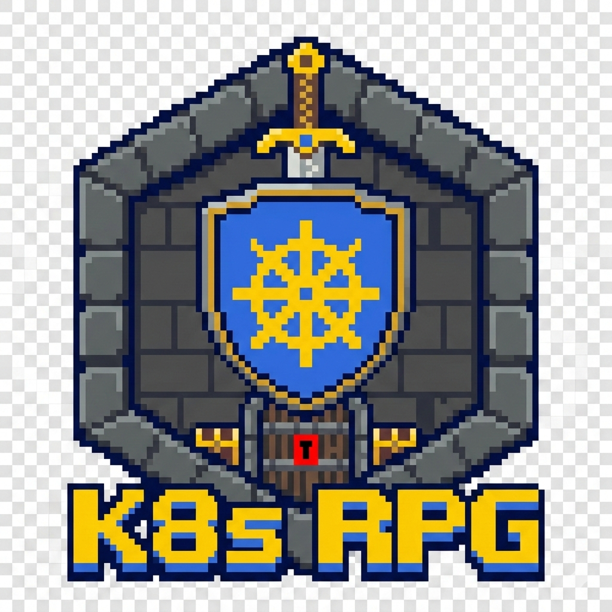

<div align="center">
  

  # Kubernetes RPG

  *An 8-bit dungeon crawler powered by kro*
</div>

---

An interactive, turn-based dungeon game where the entire game state is orchestrated by [kro](https://kro.run) ResourceGraphDefinitions. No custom controllers, no external databases. Just declarative resource graphs, CEL expressions, and kro turning Kubernetes into a programmable game engine.

## Concept

Kubernetes RPG demonstrates how [kro](https://kro.run) transforms Kubernetes into a general-purpose orchestration engine. Using kro's ResourceGraphDefinitions, we model RPG game mechanics entirely as declarative resource graphs:

| Game Entity | Kubernetes Resource |
|---|---|
| Dungeon | Custom Resource (parent RGD, orchestrates all child CRs) |
| Hero | Custom Resource → ConfigMap (hero-graph RGD) |
| Monster | Custom Resource → ConfigMap (monster-graph RGD) |
| Boss | Custom Resource → ConfigMap (boss-graph RGD) |
| Attack | Custom Resource — CRD-only stub (attack-graph RGD) |
| Action | Custom Resource — CRD-only stub (action-graph RGD) |
| Treasure | Custom Resource → ConfigMap + conditional Secret (treasure-graph RGD) |
| Loot | Custom Resource → Secret with item data (loot-graph RGD) |
| Modifier | Custom Resource → ConfigMap (modifier-graph RGD) |

Each dungeon instance gets its own Namespace for isolation and clean teardown.

## How It Works

1. **Create a Dungeon** — specify a name, monster count (1–10), difficulty (easy/normal/hard), and hero class (warrior/mage/rogue)
2. **kro reconciles** — dungeon-graph creates a Namespace, Hero CR, Monster CRs (one per monster, via forEach), Boss CR, Treasure CR, Modifier CR, and a `gameConfig` ConfigMap — all wired together via CEL expressions. Virtual `specPatch` and `stateWrite` nodes in dungeon-graph write computed state back to the Dungeon CR spec.
3. **Attack monsters** — the frontend submits a POST to the backend; the backend writes trigger fields (`attackSeq`, `lastAttackTarget`, `lastAttackSeed`, `lastAttackIndex`, `lastAttackIsBoss`, `lastAttackIsBackstab`) to the Dungeon CR and polls until kro's `combatResolve` specPatch fires — kro CEL is the authoritative combat engine. The backend then reads the result, computes loot drops and log text, and writes `lastLootDrop` and `xpEarned`.
4. **Use items** — same pattern via Action CR; the backend runs item/equip/room logic and patches the spec directly
5. **Boss unlocks** — when all monster HP = 0, kro's CEL in `boss-graph` transitions `bossState` to `ready`; the Dungeon CR status aggregates this via `dungeon-graph` CEL
6. **Defeat the boss** — boss has three phases driven by HP thresholds in `boss-graph` CEL (Phase 1 → Phase 2 ENRAGED → Phase 3 BERSERK), each with higher counter damage and special attack chance
7. **Enter Room 2** — after the boss falls, treasure auto-opens, door auto-unlocks; clicking the door triggers `enter-room-2`, which resets to a harder set of monsters (trolls/ghouls) and a bat-boss
8. **Final victory** — defeat the Room 2 boss to conquer the dungeon; the run is recorded to the leaderboard

**kro is the game engine.** All entity state transitions, derived fields, conditional resource creation, and readiness gating are pure CEL inside RGD YAML — no sidecar controllers.

## Architecture

```
┌─────────────┐     ┌─────────────┐     ┌──────────────────────┐
│  React SPA  │────▶│  Go Backend │────▶│  Kubernetes API       │
│  (8-bit UI) │◀────│  (gateway)  │◀────│  + kro controller     │
└─────────────┘  WS └─────────────┘watch└──────────────────────┘
     nginx              │                       ▲
     proxy ─────────────┘                       │ sync
                                           ┌────┴─────┐
                                           │ Argo CD  │
                                           │ (GitOps) │
                                           └────┬─────┘
                                                │
                                           ┌────┴─────┐
                                           │ Git Repo │
                                           └──────────┘
```

- **Frontend** — 8-bit pixel art React SPA. All game state read from Dungeon CR `spec` (not `status`, which can be stale after room transitions). Nginx reverse-proxies `/api/` to the backend. Includes a kro teaching layer: InsightCards, KroGlossary, CelTrace, live resource graph (KroGraph), Inspector panel, and an in-browser CEL Playground.
- **Backend** — Stateless Go service. Only touches Dungeon, Attack, and Action CRs — never reads Pods, Secrets, or Jobs directly. Writes trigger fields to the Dungeon CR spec and polls for kro's CEL specPatch results; computes loot drops, log text, XP, leaderboard entries, and room-transition triggers. Includes rate limiting (300 ms/dungeon), Prometheus metrics on `/metrics`, and a CEL eval endpoint.
- **Kubernetes + kro** — Sole source of truth. Nine RGDs orchestrate the game via CR chaining. kro is self-installed via Helm (patched fork `cel-writeback-d`).
- **Argo CD** — Runs as an [EKS Managed Capability](https://docs.aws.amazon.com/eks/latest/userguide/argocd.html). Continuously syncs all cluster manifests from this repo. GitHub webhook provides ~6 s sync latency.
- **Observability** — CloudWatch Container Insights, structured JSON logs from the backend, CloudWatch dashboard and alarms. Prometheus metrics scraped from `/metrics`.

## The Nine RGDs

All nine ResourceGraphDefinitions live in `manifests/rgds/`:

| RGD | File | What it creates |
|---|---|---|
| `dungeon-graph` | `dungeon-graph.yaml` | Namespace, Hero CR, Monster CRs (forEach), Boss CR, Treasure CR, Modifier CR, `gameConfig` CM, plus `specPatch` virtual nodes for combat/action/DoT/ability resolution |
| `hero-graph` | `hero-graph.yaml` | `heroState` ConfigMap (entityState, maxHP, damageModifier, defense, dodgeChance) |
| `monster-graph` | `monster-graph.yaml` | `monsterState` ConfigMap; conditional Loot CR on kill (includeWhen: HP=0) |
| `boss-graph` | `boss-graph.yaml` | `bossState` ConfigMap with multi-phase derivation; conditional Loot CR on kill |
| `treasure-graph` | `treasure-graph.yaml` | `treasureState` ConfigMap; conditional dungeon-key Secret when opened |
| `modifier-graph` | `modifier-graph.yaml` | `modifierState` ConfigMap (curse/blessing effects via CEL) |
| `loot-graph` | `loot-graph.yaml` | Loot Secret (itemType, rarity, stat, description — all CEL-derived) |
| `attack-graph` | `attack-graph.yaml` | CRD-only stub (`resources: []`); defines the Attack CRD |
| `action-graph` | `action-graph.yaml` | CRD-only stub (`resources: []`); defines the Action CRD |

### Key kro patterns demonstrated

- **RGD composition via CR chaining** — `dungeon-graph` spawns child CRs; each child is reconciled by its own RGD
- **forEach dynamic fan-out** — Monster CRs created from the `monsterHP` array spec field using a named loop variable (`idx`)
- **includeWhen conditional resources** — Loot CRs only created when HP = 0; treasure Secret only when opened = 1; Modifier CR only when modifier ≠ "none"
- **readyWhen readiness gates** — Modifier CR gates its readyWhen on `modifierType != ""`
- **specPatch write-back** — `dungeon-graph` uses custom `specPatch` virtual nodes to write computed state (HP mutations, cooldowns, DoT ticks, loot drops) back into the Dungeon CR spec — turning kro into a stateful CEL state machine
- **CEL state machines** — Boss phase (normal → ENRAGED → BERSERK → defeated) computed entirely in CEL from HP thresholds
- **Deterministic randomness** — `random.seededString()` in `monster-graph` pre-rolls loot type/rarity at monster spawn; no imperative code
- **Status aggregation** — `dungeon-graph` aggregates child CR statuses (livingMonsters, bossState, bossPhase, bossDamageMultiplier) via CEL `.filter()` and `.size()`
- **CRD factory pattern** — `attack-graph` and `action-graph` are empty RGDs used purely to register CRDs; all logic lives in the Go backend and dungeon-graph specPatch nodes

## Project Structure

```
├── backend/                 # Go backend service
│   ├── cmd/                 # Entrypoint (main.go)
│   └── internal/
│       ├── handlers/        # All REST handlers + game math + leaderboard
│       └── k8s/             # Dynamic client, watchers, GVR definitions
├── frontend/                # React SPA
│   ├── src/
│   │   ├── App.tsx          # Main app (~2000 lines)
│   │   ├── KroTeach.tsx     # kro teaching layer (23 concepts, InsightCards, CelTrace, CEL Playground)
│   │   ├── KroGraph.tsx     # Live SVG resource graph DAG
│   │   ├── Sprite.tsx       # Pixel art sprite components
│   │   └── api.ts           # Typed REST client
│   ├── public/sprites/      # Pixel art sprite sheets (heroes, monsters, items, icons)
│   └── nginx.conf           # Reverse-proxies /api/ to backend
├── manifests/               # Argo CD syncs this directory
│   ├── apps/                # Argo CD Application manifest
│   ├── rbac/                # ServiceAccounts, Roles, Bindings
│   ├── rgds/                # 9 kro ResourceGraphDefinitions
│   └── system/              # Deployments, CronJob, ConfigMaps
├── infra/                   # Terraform (EKS Auto Mode, kro, Argo CD, ECR, CloudWatch, OIDC)
├── tests/
│   ├── run.sh               # Integration test runner (4 sub-suites)
│   ├── guardrails.sh        # Architecture guardrails (~34 assertions)
│   ├── backend-api.sh       # REST API tests (21 tests)
│   └── e2e/
│       ├── smoke-test.js    # Playwright smoke tests (59 assertions)
│       └── journeys/        # 40 gameplay journey tests
├── scripts/
│   ├── ui-test.sh           # Deploy-and-test script (push → sync → smoke test)
│   └── watch-dungeon.sh     # tmux dashboard for watching game state live
└── .github/workflows/       # CI: build images, push to ECR, rollout restart
```

## Prerequisites

- Amazon EKS cluster with kro installed via Helm (patched fork `cel-writeback-d`) and [Argo CD](https://docs.aws.amazon.com/eks/latest/userguide/argocd.html) managed capability enabled
- `kubectl` configured for the target cluster
- See `infra/` for Terraform provisioning (EKS Auto Mode cluster, ECR repos, IAM roles, CloudWatch)

## Running the Game

### Access the UI

The game is live at **https://learn-kro.eks.aws.dev** — sign in with GitHub, create a dungeon, fight monsters, defeat the boss.

For local development against your own cluster:

```bash
kubectl port-forward svc/rpg-frontend -n rpg-system 3000:3000
```

Open http://localhost:3000

### Access the backend API directly

For local development:

```bash
kubectl port-forward svc/rpg-backend -n rpg-system 8080:8080
```

```bash
# Create a dungeon
curl -X POST http://localhost:8080/api/v1/dungeons \
  -H "Content-Type: application/json" \
  -d '{"name":"my-dungeon","monsters":3,"difficulty":"normal","heroClass":"warrior"}'

# List dungeons
curl http://localhost:8080/api/v1/dungeons

# Get dungeon state (full Dungeon CR)
curl http://localhost:8080/api/v1/dungeons/default/my-dungeon

# Attack a monster
curl -X POST http://localhost:8080/api/v1/dungeons/default/my-dungeon/attacks \
  -H "Content-Type: application/json" \
  -d '{"target":"my-dungeon-monster-0","damage":0}'

# Evaluate a CEL expression against live dungeon spec
curl -X POST http://localhost:8080/api/v1/dungeons/default/my-dungeon/cel-eval \
  -H "Content-Type: application/json" \
  -d '{"expr":"schema.spec.heroHP > 0"}'

# View leaderboard (top 20 runs by fewest turns)
curl http://localhost:8080/api/v1/leaderboard
```

### Watch game state live (tmux dashboard)

```bash
./scripts/watch-dungeon.sh my-dungeon
```

### Play via kubectl only (no UI)

```bash
cat <<EOF | kubectl apply -f -
apiVersion: game.k8s.example/v1alpha1
kind: Dungeon
metadata:
  name: my-dungeon
spec:
  monsters: 3
  difficulty: normal
  monsterHP: [50, 50, 50]
  bossHP: 400
  heroHP: 150
  heroClass: warrior
EOF

# Wait for kro to reconcile (~5-10s), then inspect state
kubectl get dungeon my-dungeon -o jsonpath='{.status}' | jq

# Attack a monster by upserting an Attack CR
cat <<EOF | kubectl apply -f -
apiVersion: game.k8s.example/v1alpha1
kind: Attack
metadata:
  name: my-dungeon-latest-attack
spec:
  dungeonName: my-dungeon
  dungeonNamespace: default
  target: my-dungeon-monster-0
  damage: 0
  seq: 1
EOF

# Clean up (writes leaderboard entry)
kubectl delete dungeon my-dungeon
```

## Game Mechanics

### Hero Classes

| Class | HP | Damage | Defense | Special |
|---|---|---|---|---|
| ⚔️ Warrior | 200 | 1.0× | 25% reduction on all counters | Taunt: 60% counter reduction for 1 round |
| 🔮 Mage | 120 | 1.3× (0.5× out of mana) | — | Heal: +40 HP, costs 2 mana; 8 mana max, +1 regen per kill |
| 🗡️ Rogue | 150 | 1.1× | 25% dodge chance | Backstab: 3× damage, 3-turn cooldown |

### Difficulty

| Difficulty | Monster HP | Boss HP | Monster counter | Boss counter | Dice |
|---|---|---|---|---|---|
| Easy | 30 | 200 | 1 per monster | 3 | 1d20+3 (4–23) |
| Normal | 50 | 400 | 2 per monster | 5 | 2d12+6 (8–30) |
| Hard | 80 | 800 | 3 per monster | 8 | 3d20+8 (11–68) |

### Multi-Phase Boss

Boss behavior scales with HP thresholds (derived in `boss-graph` CEL, read by the backend):

| Phase | HP Range | Counter Multiplier | Special Attack Chance | Visual |
|---|---|---|---|---|
| Phase 1 | >50% | 1.0× | 20% | Normal |
| Phase 2 ENRAGED | 26–50% | 1.5× | 40% | Orange glow |
| Phase 3 BERSERK | 1–25% | 2.0× | 60% | Red pulse |

### Enemy Types

**Room 1:** goblin, skeleton, archer (index ≥ 2, even — 20% stun), shaman (index ≥ 3, odd — 30% chance to heal first ally) + **Dragon boss** (25% burn, 15% stun)

**Room 2:** troll (even index), ghoul (odd index) + **Bat-boss** (30% poison, 15% stun)

### Dungeon Modifiers

Each dungeon has a random modifier (40% curse, 40% blessing, 20% none), applied at creation:

| Modifier | Type | Effect |
|---|---|---|
| Curse of Fortitude | Curse | Monsters +50% HP |
| Curse of Fury | Curse | Boss counter 2× |
| Curse of Darkness | Curse | Hero damage −25% |
| Blessing of Strength | Blessing | Hero damage +50% |
| Blessing of Resilience | Blessing | All counter damage ÷2 |
| Blessing of Fortune | Blessing | 20% chance to deal 2× damage (crit) |

### Status Effects

| Effect | Source | Duration | Per-turn damage |
|---|---|---|---|
| 🟢 Poison | Monsters (20%), Bat-boss (30%) | 3 turns | −5 HP |
| 🔴 Burn | Dragon boss (25%) | 2 turns | −8 HP |
| 🟡 Stun | Dragon/Bat-boss (15%), Archers (20%) | 1 turn | Skip hero attack |

### Equipment Slots

The hero has 8 equipment slots, all stored as fields on the Dungeon CR spec:

| Slot | Field | Common | Rare | Epic | Effect |
|---|---|---|---|---|---|
| 🗡️ Weapon | `weaponBonus` | +5 | +10 | +20 | Flat damage bonus for 3 attacks |
| 🛡️ Armor | `armorBonus` | 10% | 20% | 30% | Reduce counter-attack damage |
| 🛡️ Shield | `shieldBonus` | 10% | 15% | 25% | Chance to block counter entirely |
| 🪖 Helmet | `helmetBonus` | 5% | 10% | 15% | Crit chance (2× damage) |
| 👖 Pants | `pantsBonus` | 5% | 10% | 15% | Additional dodge chance |
| 👢 Boots | `bootsBonus` | 20% | 40% | 60% | Chance to resist status effects |
| 💍 Ring | `ringBonus` | +5 | +8 | +12 | HP regen per round |
| 📿 Amulet | `amuletBonus` | 10% | 20% | 30% | Percentage damage boost |

### Consumables

| Item | Common | Rare | Epic |
|---|---|---|---|
| ❤️ HP Potion | +20 HP | +40 HP | Full heal |
| 💎 Mana Potion | +2 mana | +3 mana | +5 mana (Mage only) |

### Loot System

Items are pre-rolled at monster spawn via `random.seededString()` in `monster-graph` — a Loot CR is conditionally included (`includeWhen: hp == 0`) so it appears only on kill. Boss always drops loot (rare or epic). Inventory cap: 8 items.

Drop chance: Easy ≈61%, Normal ≈44%, Hard ≈36%.

### New Game+

After defeating a dungeon, start a New Game+ run. Each run (up to 20) scales difficulty:
- Monster HP: ×1.25 per run
- Boss HP: ×1.25 per run
- Hero HP: ×1.10 per run
- All equipped gear carries over between runs

### Leaderboard

When a dungeon is deleted via the UI, the run is recorded to the `krombat-leaderboard` ConfigMap in `rpg-system`. The leaderboard stores up to 100 entries and shows the top 20 sorted by fewest turns. Persistent in etcd across pod restarts.

Outcomes: `victory` (both rooms cleared), `room1-cleared`, `defeat`, `in-progress` (abandoned).

## Backend API Reference

All endpoints are prefixed with `/api/v1/`.

| Method | Path | Description |
|---|---|---|
| `POST` | `/dungeons` | Create a dungeon (name, monsters 1–10, difficulty, heroClass) |
| `GET` | `/dungeons` | List all dungeons (summaries) |
| `GET` | `/dungeons/{ns}/{name}` | Get full Dungeon CR |
| `DELETE` | `/dungeons/{ns}/{name}` | Delete dungeon + record leaderboard entry |
| `POST` | `/dungeons/{ns}/{name}/attacks` | Submit attack or item action (rate limited: 300 ms/dungeon) |
| `GET` | `/dungeons/{ns}/{name}/resources` | Fetch child resource for kro Inspector (kind query param) |
| `POST` | `/dungeons/{ns}/{name}/cel-eval` | Evaluate a CEL expression against live dungeon spec |
| `GET` | `/leaderboard` | Top 20 runs by fewest turns |
| `GET` | `/events` | WebSocket — real-time Dungeon CR updates |
| `GET` | `/healthz` | Health check |
| `GET` | `/metrics` | Prometheus metrics |

### Prometheus metrics

`k8s_rpg_dungeons_created_total`, `k8s_rpg_attacks_submitted_total`, `k8s_rpg_active_dungeons`, `k8s_rpg_monsters_alive`, `k8s_rpg_monsters_dead`, `k8s_rpg_bosses_pending`, `k8s_rpg_bosses_ready`, `k8s_rpg_bosses_defeated`, `k8s_rpg_victories`, `k8s_rpg_defeats`

## kro Teaching Layer

The game teaches kro concepts interactively as you play. 23 concepts are woven into the UI:

| # | Concept ID | Triggered by |
|---|---|---|
| 1 | `rgd` | Creating first dungeon |
| 2 | `spec-schema` | Dungeon created (spec field inspection) |
| 3 | `schema-validation` | Schema validation event |
| 4 | `resource-chaining` | Viewing child resources |
| 5 | `cel-basics` | First attack |
| 6 | `cel-ternary` | Boss becoming ready |
| 7 | `forEach` | Viewing monster CRs |
| 8 | `includeWhen` | First monster kill (Loot CR appears) |
| 9 | `readyWhen` | Modifier CR with readyWhen gate |
| 10 | `status-aggregation` | All monsters dead |
| 11 | `seeded-random` | Loot drop (pre-rolled seed) |
| 12 | `secret-output` | Treasure opened (Secret created) |
| 13 | `empty-rgd` | Attack CR upserted (CRD-only RGD) |
| 14 | `spec-mutation` | Entering Room 2 |
| 15 | `externalRef` | externalRef watch pattern |
| 16 | `status-conditions` | kro status.conditions |
| 17 | `reconcile-loop` | Second attack (reconcile cycle) |
| 18 | `resourceGroup-api` | Second dungeon created |
| 19 | `cel-has-macro` | Boots equipped (optional field access) |
| 20 | `ownerReferences` | Dungeon deleted (GC chain) |
| 21 | `cel-playground` | Auto-unlocked at 10 concepts |
| 22 | `cel-filter` | Boss killed (CEL collection macros) |
| 23 | `cel-string-ops` | Loot description (CEL type coercion) |

**UI components:**
- **InsightCards** — contextual slide-in cards auto-dismissed after 12 s
- **KroGlossary** — searchable glossary in the kro tab (N/23 unlocked)
- **CelTrace** — "What kro computed" collapsible panel after each combat turn
- **KroGraph** — live SVG DAG of all child resources with node Inspector
- **CEL Playground** — in-browser sandbox: type any CEL expression, run it against the live dungeon spec via `/cel-eval` (accessible via ☰ menu in dungeon view)
- **kro Expert Certificate** — shown when all 23 concepts are unlocked
- **Onboarding overlay** — interactive intro on first visit

## Infrastructure

Provisioned by Terraform in `infra/`:

| Component | Details |
|---|---|
| Cluster | EKS Auto Mode `krombat`, Kubernetes 1.34, `us-west-2` |
| Node pools | `general-purpose` + `system` (Auto Mode managed) |
| kro | Self-installed via Helm (patched fork `cel-writeback-d`) |
| Argo CD | EKS Managed Capability, IAM Identity Center SSO |
| ECR | `krombat/backend` + `krombat/frontend` (last 10 images retained) |
| CloudWatch | Container Insights, 4 log groups, dashboard, 3 alarms |
| CI IAM | GitHub Actions OIDC role with EKS cluster admin + ECR push |

### System components (`manifests/system/`)

| Manifest | Purpose |
|---|---|
| `backend.yaml` | `rpg-backend` Deployment + Service |
| `frontend.yaml` | `rpg-frontend` Deployment + Service (nginx) |
| `dungeon-reaper.yaml` | CronJob every 10 min — deletes dungeons older than 4 h (skips dungeons with active Attacks/Actions) |
| `leaderboard-cm.yaml` | Empty `krombat-leaderboard` ConfigMap (seed for leaderboard storage) |
| `backend-pdb.yaml` | PodDisruptionBudget for the backend |

## CI/CD

`.github/workflows/build-images.yml` — triggers on every push to `main` and on PRs:

1. Build backend Docker image (multi-stage, distroless)
2. Build frontend Docker image (Node build + nginx)
3. Trivy vulnerability scan (CRITICAL/HIGH, SARIF uploaded to GitHub Security)
4. On merge to `main`: push both images to ECR with `$SHA` + `latest` tags
5. On merge to `main`: `kubectl rollout restart deployment/rpg-backend deployment/rpg-frontend -n rpg-system`

Argo CD automatically syncs manifest changes from `main` within ~6 s via GitHub webhook.

## Testing

```bash
# All suites
tests/run-all.sh

# Individual suites
tests/run.sh            # Integration: core lifecycle, abilities, features, infra
tests/guardrails.sh     # Architecture guardrails (~34 assertions)
tests/backend-api.sh    # REST API (21 tests)
BASE_URL=https://learn-kro.eks.aws.dev node tests/e2e/smoke-test.js   # UI smoke (59 assertions)

# Run a specific journey
BASE_URL=https://learn-kro.eks.aws.dev node tests/e2e/journeys/20-leaderboard.js
```

### Journey tests (40 total)

| # | Journey | Focus |
|---|---|---|
| 01 | Warrior Easy | Full UI playthrough |
| 02 | Mage Normal | Abilities & mana |
| 03 | Rogue Hard | Dodge & Backstab |
| 04 | Items & Equipment | Equip/use flow |
| 05 | Status Effects | Poison, Burn, Stun |
| 06 | Dungeon Modifiers | All 6 modifier types |
| 07 | Dungeon Management | Create/list/delete |
| 08 | Edge Cases | Error states, validation |
| 09 | K8s Log Tab | Structured log display |
| 10 | Animations | Sprite hurt/dead frames, phase glow |
| 11 | Room 2 Full Victory | Both rooms end-to-end |
| 12 | kro Teaching Layer | InsightCards, glossary, CelTrace, graph |
| 13 | Defeat & Mana | Defeat screen, Mage mana restore |
| 14 | kro Inspector | Inspector panel for all node types |
| 15 | ownerReferences & Glossary | ownerRef concept, glossary search |
| 16 | Ring & Amulet Loot | Ring regen + amulet damage boost |
| 17 | CEL Playground | Modal, examples, Ctrl+Enter, live eval |
| 18 | Achievements | All 8 achievement badges |
| 19 | Enemy Variety | Goblin/skeleton/archer/shaman/troll/ghoul |
| 20 | Leaderboard | Full create→delete→leaderboard round-trip |
| 21 | New Game+ | Scaling, gear carry-over, NG+ badge |
| 22 | Dungeon Mini-Map | Mini-map room display |
| 23 | Taunt & Boss Phases | Warrior Taunt + ENRAGED/BERSERK |
| 24 | Potions & Helmet/Pants | Inventory cap (8), helmet crit, pants dodge |
| 25 | Mage Room 2 | Mana restore on room entry + HP scaling |
| 26 | kro Certificate | Expert certificate at 23/23 concepts |
| 27 | P0 Regressions | lastLootDrop clear, boss-name suffix, stale attack |
| 28 | Resume & Validation | Resume prompt, name validation, room1-cleared |
| 29 | Ring + Amulet Combat | Passive bonuses verified in live combat |
| 30 | Room 2 Boss Phases | Bat-boss ENRAGED/BERSERK |
| 31 | Inspector: specPatch nodes | KroGraph Inspector for combatResolve/actionResolve |
| 32 | CEL Playground Live Eval | Round-trip through CelEvalHandler |
| 33 | User Profile | Stats, XP, badges after dungeon delete |
| 34 | XP Levelling | XP accumulation, level-up thresholds |
| 35 | Certificates | kro Expert Certificate unlock |
| 37 | Social Run Card | Shareable SVG run card |
| 38 | Conference Demo | End-to-end demo flow |
| 39 | Reconcile Stream | Field-diff stream in kro tab |
| 40 | Blog Post Generator | AI narrative generation panel |
| 41 | Workshop Kit | Workshop helper UI |

## License

MIT
